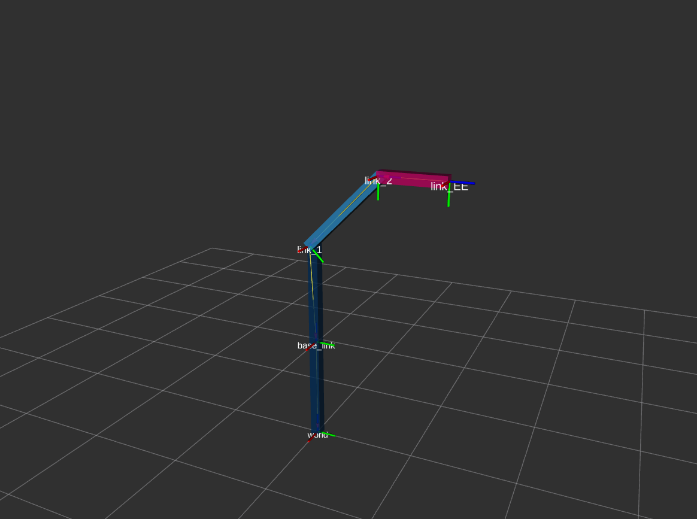
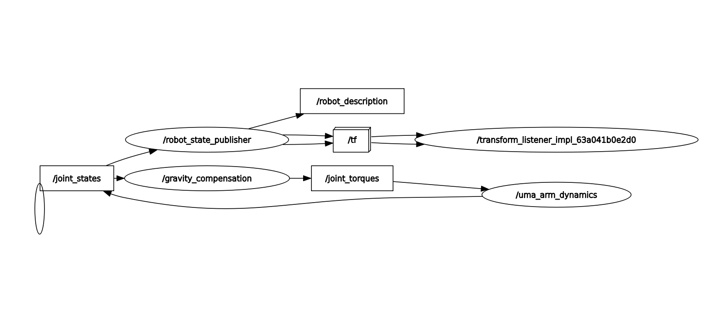
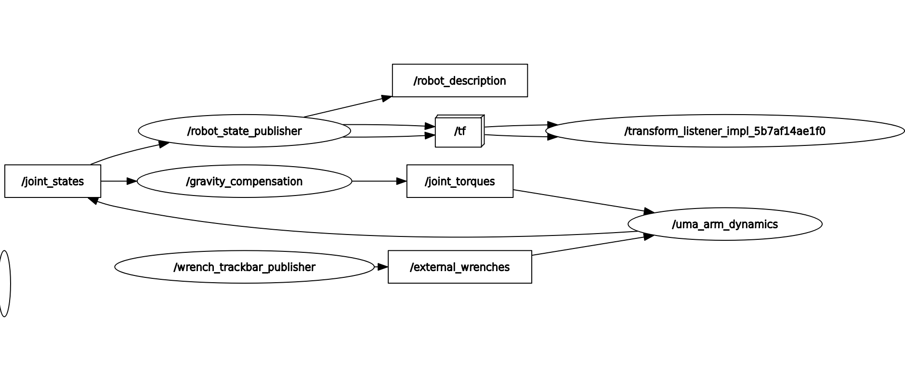
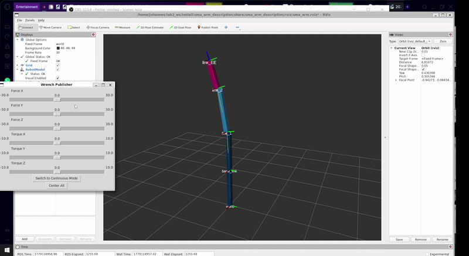
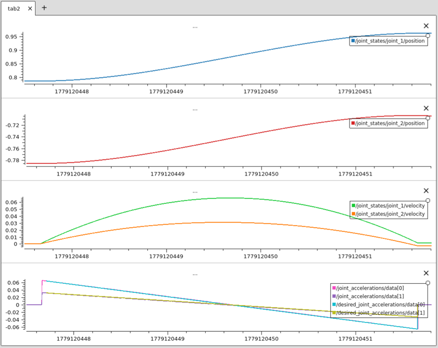
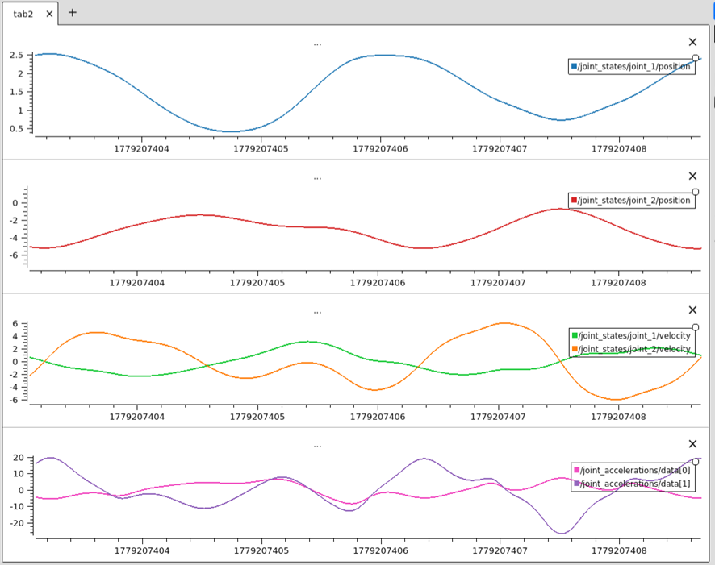
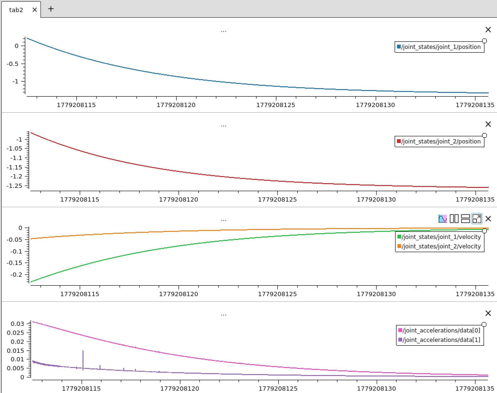

# uma_arm_control
Este es el repositorio de control del brazo UMA.

## Ejecución 

```bash
ros2 launch uma_arm_description uma_arm_visualization.launch.py
ros2 launch uma_arm_control uma_arm_dynamics_launch.py
ros2 launch uma_arm_control gravity_compensation_launch.py
ros2 launch uma_arm_control dynamics_cancellation_launch.py
ros2 launch uma_arm_control pd_controller_launch.py
```

## Control por Dinámica Inversa

### Compensación de gravedad
Método `gravity_compensation()` para calcular los pares articulares deseados:

```cpp
        // Método para calcular los pares articulares deseados
        Eigen::VectorXd gravity_compensation()
        {
            // Vector para los pares articulares
            Eigen::VectorXd torque(2);

            // Posiciones articulares actuales
            double q1 = joint_positions_(0);
            double q2 = joint_positions_(1);

            // Cálculo del vector de gravedad g(q)
            // Asume configuración planar estándar con ángulos desde la horizontal
            // y masas concentradas al final de l1 y l2.
            double g1 = (m1_ + m2_) * g_ * l1_ * std::cos(q1) + m2_ * g_ * l2_ * std::cos(q1 + q2);
            double g2 = m2_ * g_ * l2_ * std::cos(q1 + q2);

            // Asignación de los pares de control deseados
            torque << g1, g2;

            return torque;
        }
```

<div align="center">
  
  <br>
  <em>Figura 1: Resultado del Manipulador con compensación de gravedad</em>
</div>

<br>

<div align="center">
  
  <br>
  <em>Figura 2: Representación del sistema usando rqt_graph</em>
</div>

<br>

**Sección 3.1.3:**

<div align="center">
  
  <br>
  <em>Figura 3: Grafo de nodos y tópicos</em>
</div>

<br>

<div align="center">
  
  <br>
  <em>Figura 4: Animación de la simulación y fuerzas actuantes</em>
</div>

### Linealización mediante control por dinámica inversa

Cuando el movimiento deseado del manipulador requiere grandes velocidades y aceleraciones articulares, los términos de acoplamiento no lineal influyen fuertemente en el rendimiento del sistema. En estos casos, una estrategia de control descentralizada no es adecuada. En su lugar, utilizamos un enfoque de control centralizado conocido como **Control por Dinámica Inversa** (o Linealización por Realimentación Exacta).

La dinámica de un manipulador de $n$ articulaciones puede describirse mediante la siguiente ecuación:

$$M(q)\ddot{q} + n(q,\dot{q}) = \tau$$

donde $n(q,\dot{q})$ agrupa todos los términos no lineales (Coriolis, fuerzas centrífugas, fricción viscosa y gravedad):

$$n(q,\dot{q}) = C(q,\dot{q})\dot{q} + F_b\dot{q} + g(q)$$

El objetivo del control por dinámica inversa es realizar una linealización exacta de la dinámica del sistema mediante una realimentación de estado no lineal. Definimos nuestra entrada de control $\tau$ como una función del estado del manipulador:

$$\tau = M(q)y + n(q,\dot{q})$$

Sustituyendo esta ley de control de vuelta en el modelo dinámico, las no linealidades se cancelan perfectamente y el sistema se reduce a un simple doble integrador desacoplado:

$$\ddot{q} = y$$

Una vez que el sistema está linealizado, $y$ representa un nuevo vector de entrada que dicta el comportamiento dinámico deseado. Ahora podemos seguir fácilmente una trayectoria deseada $q_d(t)$ aplicando una ley de control lineal estabilizadora, como un controlador Proporcional-Derivativo (PD):

$$y = \ddot{q}_d + K_D\dot{\tilde{q}} + K_P\tilde{q}$$

donde $\tilde{q} = q_d - q$ es el error de seguimiento, y $K_P$ y $K_D$ son matrices diagonales definidas positivas. Esto garantiza que el error de posición converja asintóticamente a cero.

#### Formulación de Euler-Lagrange para un Robot Planar de 2 GDL

Para implementar la cancelación dinámica exacta, derivamos el modelo matemático utilizando la formulación de **Euler-Lagrange**. El Lagrangiano $L$ se define como la diferencia entre la Energía Cinética ($K$) y la Energía Potencial ($P$):

$$L = K - P$$

Los pares articulares $\tau_i$ se obtienen a través de la ecuación de Euler-Lagrange:

$$\tau_i = \frac{d}{dt} \left( \frac{\partial L}{\partial \dot{q}_i} \right) - \frac{\partial L}{\partial q_i}$$

Asumiendo un manipulador planar estándar de 2 GDL con masas puntuales $m_1$ y $m_2$ al final de eslabones de longitudes $l_1$ y $l_2$:

**1. Energía Potencial y Vector de Gravedad $g(q)$**
La energía potencial depende únicamente de la altura (eje y) de las masas:

$$P = m_1 g l_1 \sin(q_1) + m_2 g (l_1 \sin(q_1) + l_2 \sin(q_1 + q_2))$$

El vector de gravedad $g(q)$ se obtiene tomando la derivada parcial de $P$ con respecto a cada variable articular $q_i$:

$$g_1(q) = \frac{\partial P}{\partial q_1} = (m_1 + m_2) g l_1 \cos(q_1) + m_2 g l_2 \cos(q_1 + q_2)$$
$$g_2(q) = \frac{\partial P}{\partial q_2} = m_2 g l_2 \cos(q_1 + q_2)$$

**2. Energía Cinética, Matriz de Inercia $M(q)$ y Coriolis $C(q,\dot{q})$**
La energía cinética total es la suma de las energías cinéticas de las dos masas puntuales:

$$K = \frac{1}{2} m_1 v_1^2 + \frac{1}{2} m_2 v_2^2$$

Expresando las velocidades lineales $v_1$ y $v_2$ en términos de las velocidades articulares $\dot{q}_1$ y $\dot{q}_2$, obtenemos:

$$K = \frac{1}{2} \left[ (m_1+m_2)l_1^2 + m_2 l_2^2 + 2m_2 l_1 l_2 \cos(q_2) \right] \dot{q}_1^2 + \frac{1}{2} m_2 l_2^2 \dot{q}_2^2 + \left[ m_2 l_2^2 + m_2 l_1 l_2 \cos(q_2) \right] \dot{q}_1 \dot{q}_2$$

Aplicando el operador de Euler-Lagrange a $K$ se obtiene la Matriz de Inercia $M(q)$:

$$M_{11} = (m_1+m_2)l_1^2 + m_2 l_2^2 + 2m_2 l_1 l_2 \cos(q_2)$$
$$M_{12} = M_{21} = m_2 l_2^2 + m_2 l_1 l_2 \cos(q_2)$$
$$M_{22} = m_2 l_2^2$$

Y los términos de Coriolis y centrífugos $C(q,\dot{q})\dot{q}$, definiendo $h = m_2 l_1 l_2 \sin(q_2)$:

$$C(q,\dot{q})\dot{q} = \begin{bmatrix} -h \dot{q}_2^2 - 2h \dot{q}_1 \dot{q}_2 \\ h \dot{q}_1^2 \end{bmatrix}$$

Estos términos derivados son los que se utilizan directamente en la implementación del nodo.

#### Implementación de `cancel_dynamics()`

```cpp
        // Método para calcular la aceleración articular
        Eigen::VectorXd cancel_dynamics()
        {
            // Inicializar M, C (C*q_dot), Fb, g_vec
            Eigen::MatrixXd M(2, 2);
            Eigen::VectorXd C_vec(2); 
            Eigen::VectorXd Fb_vec(2);
            Eigen::VectorXd g_vec(2);

            // Inicializar q1, q2, q_dot1 y q_dot2
            double q1 = joint_positions_(0);
            double q2 = joint_positions_(1);
            double q_dot1 = joint_velocities_(0);
            double q_dot2 = joint_velocities_(1);
            
            // Extraer las aceleraciones articulares deseadas (y en el esquema de control)
            Eigen::VectorXd q_ddot_d = desired_joint_accelerations_;

            // Calcular matriz M (Matriz de Inercia)
            M(0, 0) = (m1_ + m2_) * l1_ * l1_ + m2_ * l2_ * l2_ + 2.0 * m2_ * l1_ * l2_ * std::cos(q2);
            M(0, 1) = m2_ * l2_ * l2_ + m2_ * l1_ * l2_ * std::cos(q2);
            M(1, 0) = M(0, 1);
            M(1, 1) = m2_ * l2_ * l2_;

            // Calcular vector C (C es de 2x1 porque ya incluye q_dot)
            // Representa las fuerzas de Coriolis y centrífugas
            double h = m2_ * l1_ * l2_ * std::sin(q2);
            C_vec(0) = -h * q_dot2 * q_dot2 - 2.0 * h * q_dot1 * q_dot2;
            C_vec(1) = h * q_dot1 * q_dot1;

            // Calcular vector Fb (Fricción viscosa: Fb * q_dot)
            Fb_vec(0) = b1_ * q_dot1;
            Fb_vec(1) = b2_ * q_dot2;

            // Calcular g_vect (Vector de gravedad)
            g_vec(0) = (m1_ + m2_) * g_ * l1_ * std::cos(q1) + m2_ * g_ * l2_ * std::cos(q1 + q2);
            g_vec(1) = m2_ * g_ * l2_ * std::cos(q1 + q2);

            // Calcular el par de control usando el modelo dinámico: torque = M * q_ddot_d + C * q_dot + Fb * q_dot + g
            Eigen::VectorXd torque(2);
            torque = M * q_ddot_d + C_vec + Fb_vec + g_vec;

            return torque;
        }
```

El resultado del experimento es:




### Experimentos

#### What happens if the dynamics compensation model is not exactly the same as the manipulator dynamics?

APARTADO A: Alteraremos los valores de gravity compensation.

Con  (m1:3.0, m2:2.0, l1:1.0 y l2:0.6):


Con  (m1:3.0, m2:2.0, l1:1.0 y l2:0.6):


APARTADO B: Alteraremos los valores de dynamics cancellation.

Con  (m1:3.0, m2:2.0, l1:1.0, l2:0.6, b1:5.0 y b2:5.0):


Con  (m1:3.0, m2:2.0, l1:1.5, l2:0.2, b1:5.0 y b2:5.0):



Con  (m1:3.0, m2:2.0, l1:1.0, l2:0.6, b1:4.0 y b2:4.0):




#### What is the behavior of the robot under the inverse dynamics controller when you apply virtual forces to the EE?


### 4. Controlador PD en el espacio articular con compensación de dinámicas no lineales

Al implementar una estrategia de control centralizada como el **Control por Dinámica Inversa** (o Linealización por Realimentación), las dinámicas no lineales del manipulador ($M(q)$, $C(q, \dot{q})$, $F_b$, y $g(q)$) se cancelan perfectamente. Esto reduce el complejo sistema a un conjunto de dobles integradores desacoplados:

$$\ddot{q} = y$$

Para lograr un seguimiento asintótico de una trayectoria deseada $q_d(t)$, la entrada de control auxiliar $y$ se elige como una ley de control estabilizadora Proporcional-Derivativa (PD):

$$y = \ddot{q}_d + K_D\dot{\tilde{q}} + K_P\tilde{q}$$

donde el error de seguimiento es $\tilde{q} = q_d - q$ y su derivada es $\dot{\tilde{q}} = \dot{q}_d - \dot{q}$.

#### Control Regulatorio (Setpoint Constante)
Para una tarea donde la posición articular deseada $q_d$ es constante, la velocidad y aceleración deseadas son cero ($\dot{q}_d = 0$, $\ddot{q}_d = 0$). Sustituyendo estas condiciones en la ley de control estabilizadora se obtiene la expresión simplificada:

$$y = K_P(q_d - q) - K_D\dot{q}$$

#### Selección de $K_P$ y $K_D$
Para garantizar la estabilidad asintótica, las matrices de ganancia $K_P$ y $K_D$ deben ser definidas positivas y diagonales. El comportamiento dinámico del error de posición está definido por una ecuación diferencial de segundo orden para cada articulación, donde las ganancias corresponden a:

$$K_P = \text{diag}\{\omega_{n1}^2, \dots, \omega_{nn}^2\}$$
$$K_D = \text{diag}\{2\zeta_1\omega_{n1}, \dots, 2\zeta_n\omega_{nn}\}$$

Para conseguir una respuesta rápida sin sobreoscilación (amortiguamiento crítico), la relación de amortiguamiento se establece en $\zeta = 1$. Asumiendo una frecuencia natural de $\omega_n = 10 \text{ rad/s}$ para todas las articulaciones, las ganancias resultantes son:
* $K_P = 100$
* $K_D = 20$

#### Implementación del Nodo de Control Lineal Estabilizador

```cpp
/*
    Nodo Controlador PD para la Linealización por Dinámica Inversa
    Devuelve la entrada de control auxiliar 'y' (publicada como desired_joint_accelerations)
*/

#include <rclcpp/rclcpp.hpp>
#include <sensor_msgs/msg/joint_state.hpp>
#include <std_msgs/msg/float64_multi_array.hpp>
#include <Eigen/Dense>
#include <vector>

class PDControllerNode : public rclcpp::Node
{
public:
    PDControllerNode() : Node("pd_controller_node")
    {
        // Declarar parámetros con valores por defecto basados en el amortiguamiento crítico (wn = 10, zeta = 1)
        this->declare_parameter<std::vector<double>>("qd", {1.0, 1.0}); // Posición deseada por defecto
        this->declare_parameter<double>("kp", 100.0);
        this->declare_parameter<double>("kd", 20.0);

        // Obtener parámetros
        std::vector<double> qd_param = this->get_parameter("qd").as_double_array();
        qd_ = Eigen::VectorXd::Map(qd_param.data(), qd_param.size());
        
        kp_ = this->get_parameter("kp").as_double();
        kd_ = this->get_parameter("kd").as_double();

        // Crear publicador para la entrada de control auxiliar 'y' (aceleraciones deseadas)
        publisher_ = this->create_publisher<std_msgs::msg::Float64MultiArray>("desired_joint_accelerations", 1);
        
        // Crear suscriptor para los estados articulares actuales
        subscriber_ = this->create_subscription<sensor_msgs::msg::JointState>(
            "joint_states", 1, std::bind(&PDControllerNode::joint_states_callback, this, std::placeholders::_1));
            
        RCLCPP_INFO(this->get_logger(), "Nodo Controlador PD inicializado con Kp=%.2f, Kd=%.2f", kp_, kd_);
    }

private:
    void joint_states_callback(const sensor_msgs::msg::JointState::SharedPtr msg)
    {
        Eigen::VectorXd q(2);
        Eigen::VectorXd q_dot(2);

        // Extraer posiciones y velocidades articulares
        auto joint1_index = std::find(msg->name.begin(), msg->name.end(), "joint_1") - msg->name.begin();
        auto joint2_index = std::find(msg->name.begin(), msg->name.end(), "joint_2") - msg->name.begin();

        if (static_cast<size_t>(joint1_index) < msg->name.size() && 
            static_cast<size_t>(joint2_index) < msg->name.size())
        {
            q(0) = msg->position[joint1_index];
            q(1) = msg->position[joint2_index];
            q_dot(0) = msg->velocity[joint1_index];
            q_dot(1) = msg->velocity[joint2_index];

            // Calcular la ley de control lineal estabilizadora: y = Kp*(qd - q) - Kd*q_dot
            // (Asumiendo q_ddot_d = 0 y q_dot_d = 0)
            Eigen::VectorXd y = kp_ * (qd_ - q) - kd_ * q_dot;

            // Publicar 'y' al tópico esperado por el nodo de cancelación dinámica
            auto y_msg = std_msgs::msg::Float64MultiArray();
            y_msg.data.assign(y.data(), y.data() + y.size());
            publisher_->publish(y_msg);
        }
    }

    // Variables miembro
    Eigen::VectorXd qd_;
    double kp_;
    double kd_;
    rclcpp::Publisher<std_msgs::msg::Float64MultiArray>::SharedPtr publisher_;
    rclcpp::Subscription<sensor_msgs::msg::JointState>::SharedPtr subscriber_;
};

int main(int argc, char *argv[])
{
    rclcpp::init(argc, argv);
    auto node = std::make_shared<PDControllerNode>();
    rclcpp::spin(node);
    rclcpp::shutdown();
    return 0;
}
```

````</PDControllerNode></Eigen/Dense>