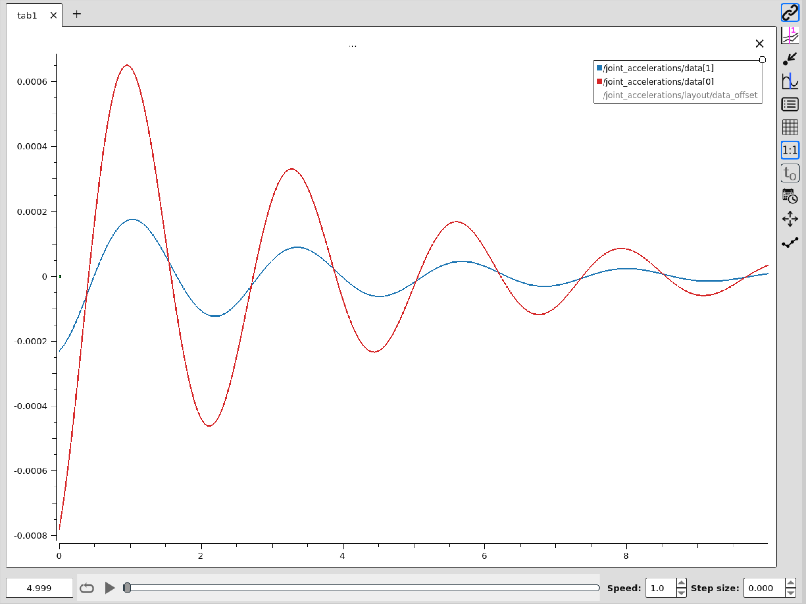
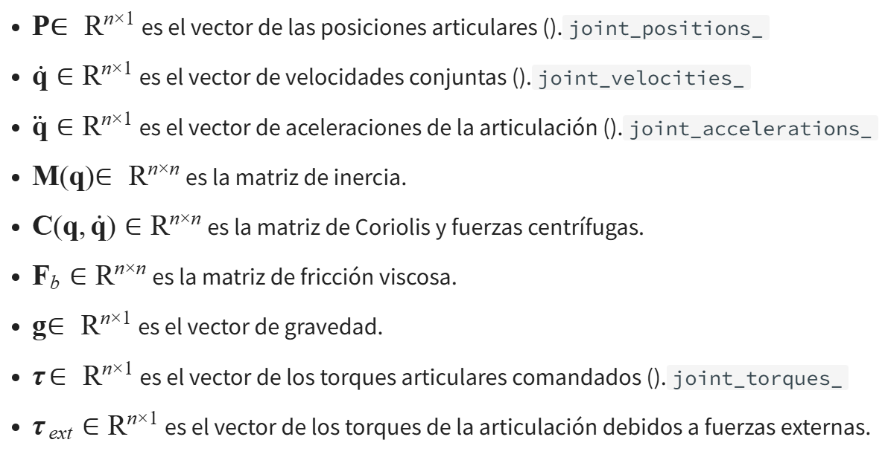
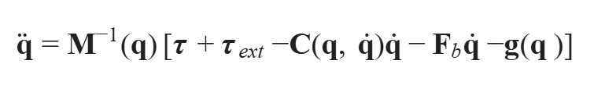
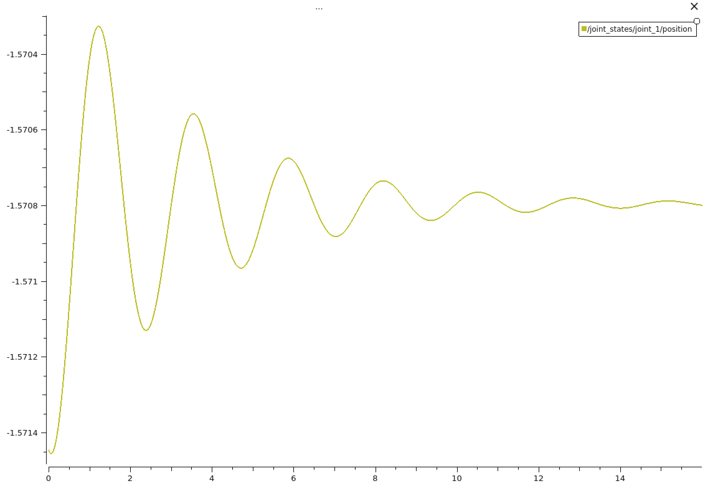
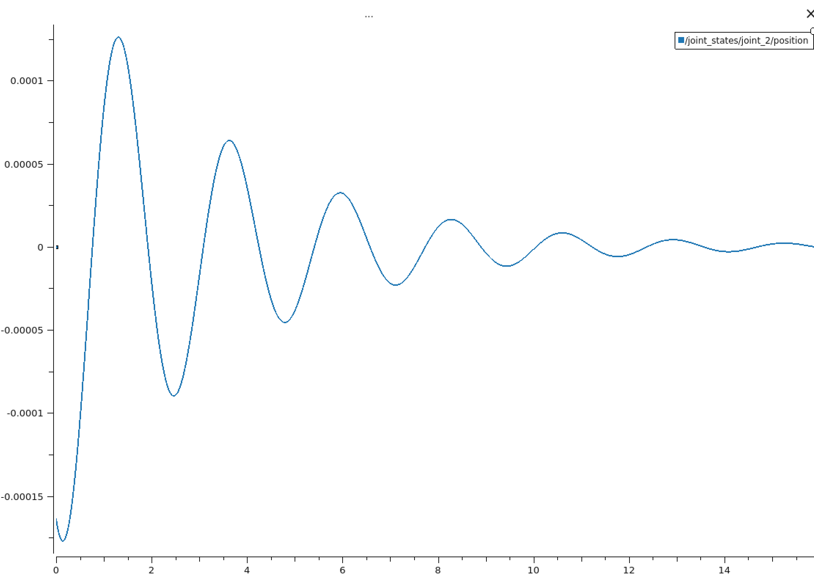
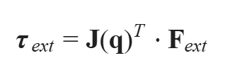
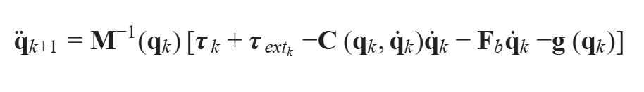
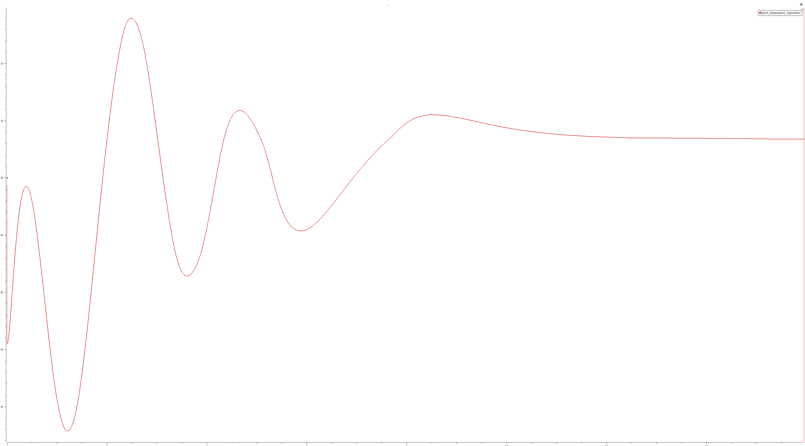
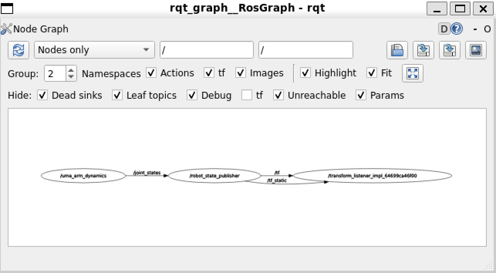
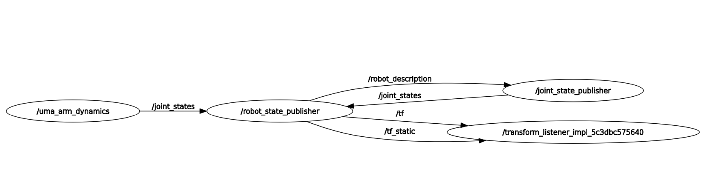

# uma_arm_control
This is the UMA arm control repo

## Launch the Dynamic model
ros2 launch uma_arm_control uma_arm_dynamics_launch.py

## Implementación del modelo dinámico

### Calcular la aceleración

La dinámica de un manipulador robótico de cadena cinemática abierta está dada por:

$$ \mathbf{M}(\mathbf{q})\ddot{\mathbf{q}} + \mathbf{C}(\mathbf{q}, \dot{\mathbf{q}})\dot{\mathbf{q}} + \mathbf{F}_b\dot{\mathbf{q}} + \mathbf{g}(\mathbf{q}) = \boldsymbol{\tau} + \boldsymbol{\tau}_{ext} $$

donde:

En nuestro caso, la aceleración debida a los torques aplicados está dada por:

Para calcular las aceleraciones de las articulaciones, primero necesitamos calcular las matrices. Pueden calcularse aplicando las formulaciones de Lagrange o Newton-Euler. En nuestro caso, las matrices se definen por:

También necesitaremos calcular el jacobiano para incluir las llaves externas aplicadas en el EE en nuestro modelo:

Entonces, podemos calcular τ_ext como:

### Integrar posición y velocidad

Como estamos implementando un sistema discreto:

podemos obtener las velocidades y posición conjuntas mediante integración discreta a lo largo del tiempo como:

## Lanzar el nodo del simulador dinámico

## Representación gráfica